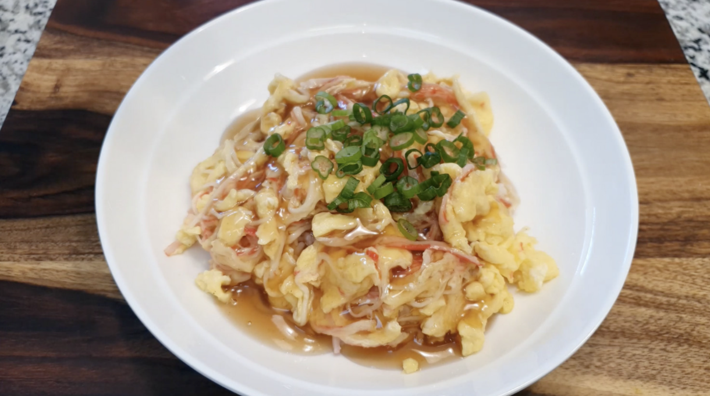

---
layout: post
read_time: true
show_date: true
title:  "전자렌지로 만드는 약밥"
date:   2021-04-20 22:09:20 -0600
description: 든든하게 먹어요
img: posts/20210420/n5.JPG
tags: [자취생 요리, 간단 요리, 간식, 한식]
author: 김주환
github:  https://github.com/kimjuhwan0625/kimjuhwan0625.github.io
mathjax: yes
---
밥과 간식 사이!! 달달하면서도 든든한 약밥을 전자렌지만으로 간단하게 만드는 법을 알려드릴게요. 

<iframe width="560" height="315" src="https://youtu.be/ePRff3ZB-V4" title="YouTube video player" frameborder="0" allow="accelerometer; autoplay; clipboard-write; encrypted-media; gyroscope; picture-in-picture" allowfullscreen></iframe>

이 글은 [만개의레시피 유튜브](https://youtu.be/ePRff3ZB-V4) 를 참고하여 만들었습니다. 

재료: [찹쌀](https://www.coupang.com/vp/products/327924416?itemId=1048941653&vendorItemId=5513884608&sourceType=srp_product_ads&clickEventId=c4c708c3-f001-443c-b1b5-28194cebc1bf&korePlacement=15&koreSubPlacement=1&clickEventId=c4c708c3-f001-443c-b1b5-28194cebc1bf&korePlacement=15&koreSubPlacement=1&q=%EC%B0%B9%EC%8C%80&itemsCount=36&searchId=f8bf0309c7884b6a9bc6b24bcf6fb49c&rank=0), 각종 견과류, [흑설탕](https://www.coupang.com/vp/products/475751?itemId=1181030&vendorItemId=74720099184&q=%ED%9D%91%EC%84%A4%ED%83%95&itemsCount=36&searchId=a5932c2b419f45cd999965886ece14ff&rank=6), [간장](https://www.coupang.com/vp/products/1950520915?itemId=3313290034&vendorItemId=71264859094&pickType=COU_PICK&sourceType=srp_product_ads&clickEventId=f2238382-8215-4d83-877d-d50032ba92ee&korePlacement=15&koreSubPlacement=1&clickEventId=f2238382-8215-4d83-877d-d50032ba92ee&korePlacement=15&koreSubPlacement=1&q=%EA%B0%84%EC%9E%A5&itemsCount=36&searchId=1aabb33de0714e22ba4af7ce5c382615&rank=0), [꿀](https://www.coupang.com/vp/products/1388706773?itemId=2424220845&vendorItemId=70418284525&sourceType=srp_product_ads&clickEventId=aa26b8ed-a4ab-416c-a657-7315098e0bc7&korePlacement=15&koreSubPlacement=1&clickEventId=aa26b8ed-a4ab-416c-a657-7315098e0bc7&korePlacement=15&koreSubPlacement=1&q=%EA%BF%80&itemsCount=36&searchId=2bce4607ff9a49c39dfa65480ed78617&rank=0), [계피가루](https://www.coupang.com/vp/products/1968165?itemId=6864743289&vendorItemId=70140007483&q=%EA%B3%84%ED%94%BC%EA%B0%80%EB%A3%A8&itemsCount=36&searchId=d9d46905365042a7b70f488d0af6c0a0&rank=1), [소금](https://www.coupang.com/vp/products/5115974557?itemId=6987620953&vendorItemId=3036730760&q=%EC%86%8C%EA%B8%88&itemsCount=36&searchId=76198c52e2d54cba95cc043bf66e89ac&rank=1)

조리순서

1.찹쌀을 물에 씻고 20~30분간 불려주세요.

2.약밥에 들어갈 재료들을 손질해주세요

3.소스를 만들어줍니다.(흑설탕 2+1/2숟가락, 참기름 1/4숟가락, 간장 1+1/2숟가락, 꿀 1/2숟가락, 계피가루 약간, 소금 약간)

4.찹쌀의 물기를 제거한 후 물, 소스, 재료를 모두 넣고 전자레인지에 15~20분 돌린후 2분간 뜸을 들이고 꺼내줍니다.(기호에 따라 참기름 추가)

5.약밥을 넓게 펼쳐 한 김 식힌 후, 모양을 만들어 먹기 좋게 자르면 완성!!!

추운겨울 차갑게 먹어도 맛있고 따뜻하게 먹으면 더 맛있는 약밥으로 방콕하면서 행복하게 지내요!

